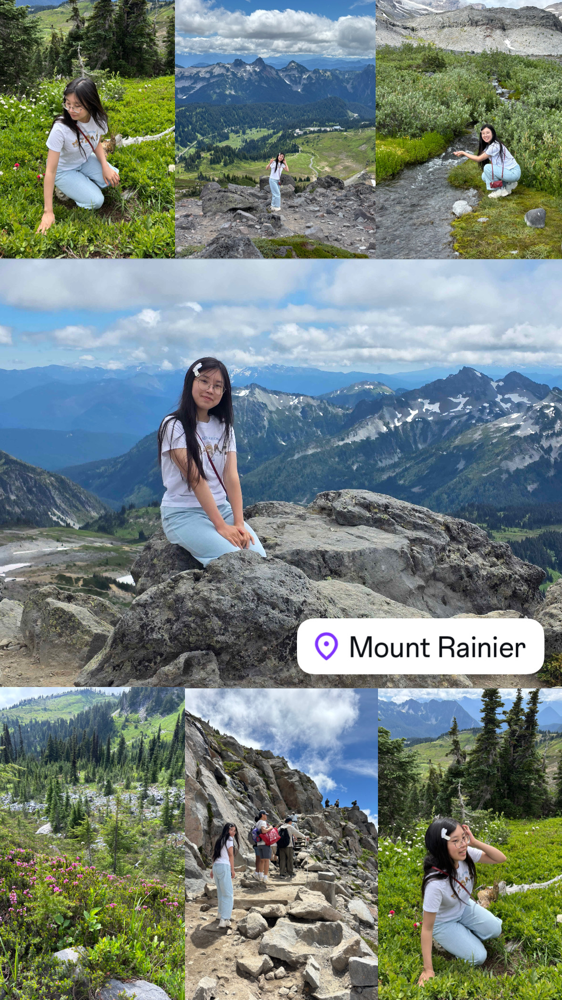

# Template Portfolio

This will be your portfolio repository. Use this as a [template repository](https://docs.github.com/en/repositories/creating-and-managing-repositories/creating-a-template-repository) and customize it to your own tastes. We gave you a starting point with a space to describe yourself and a link to where your assignment 1 file can be.

# About Me

_My name is Jocelyn Zheng, I'm a junior majoring in 6-3, it's nice to meet you!_

Some fun facts about me:

1. I love cats.
2. I interned at Amazon in Seattle over the summer.
3. I enjoy hiking.

# Table of Contents

[Link to Assignment 1](assignments/assignment1.md)
[Link to Pset 1](psets/pset1.md)
